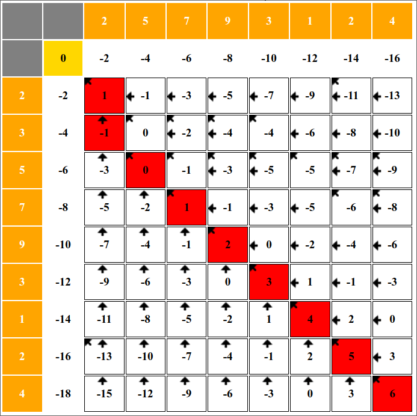

# Testing Documentation
- This document contains the tests for the implemented algorithms.
- To run the algorithm test files in src, run the following command:
```bash
npm test
```
- To run a single test files, run the script with `node`, `deno`, `bunx` (or any other JavaScript runtime of choice) with the file name. For example:
```bash
deno run src/analysis/test-algorithm.js
``` 

## Needleman-Wunsch Algorithm
- To verify the algorithm, we use the following examples:
### nw_test01()
```md
Input list A: [2, 5, 7, 9, 3, 1, 2, 4] 
Input list B: [2, 3, 5, 7, 9, 5, 2, 1, 4]
```

- Expected matrix (using https://github.com/drdrsh/Needleman-Wunsch):


## Smith-Waterman Algorithm
### sw_test01()
```md
Input list A: [2, 5, 7, 9, 3, 1, 2, 4]
Input list B: [2, 3, 5, 7, 9, 5, 2, 1, 4]
```
